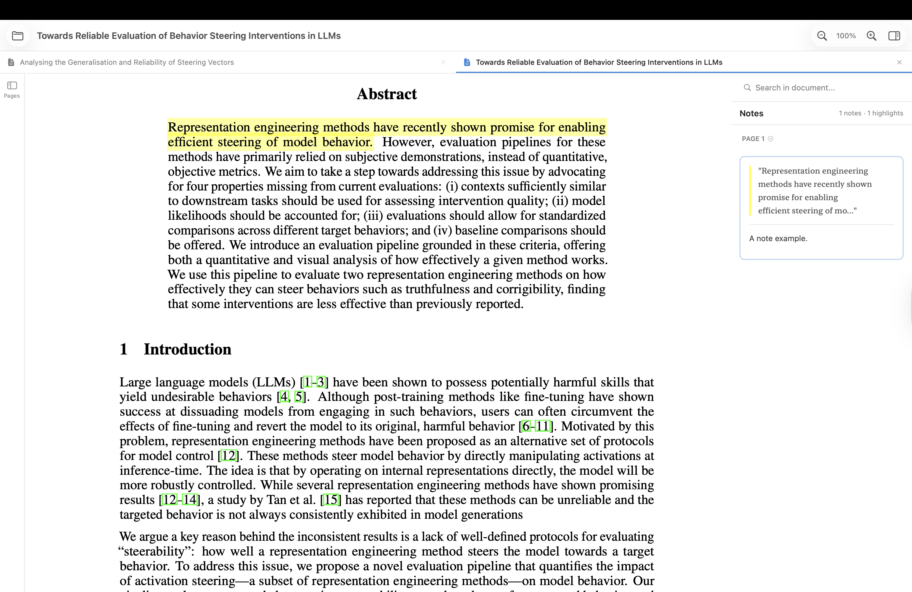

# 「明天读」
### 我明天真的一定会读的:P 
### 这次绝对不骗人。

**一个专为读论文设计的 macOS PDF 阅读器。**

右键一下就能高亮批注 —— 不用再翻菜单了。
内置英译中，400+ 机器学习/AI/数学术语自动翻译正确。
多标签页打开论文，像浏览器一样切换。

## 为什么不用 Preview？

| 功能 | Preview | 明天读 |
|------|---------|--------|
| 快速高亮 | 藏在菜单里 | 右键一下 |
| 多色高亮 | 有限 | 5 种颜色 |
| 翻译 | 没有 | 内置英译中 |
| ML/AI 术语表 | 没有 | 400+ 术语 |
| 多标签页 | 没有 | 有 |
| 自动保存 | 没有 | 每 30 秒 |

## 适合谁用

- 读英文论文的研究人员
- 学 ML/AI/CS 的学生
- 受够了 Preview 批注体验的人

## 下载

[下载最新版本](../../releases/latest)

### 安装方法

1. 下载 `Reader.zip`
2. 解压后运行
3. **首次打开：** 系统设置 → 隐私与安全性 → 点击「仍要打开」

### 设为默认 PDF 阅读器

1. 在访达中右键点击任意 PDF 文件
2. 点击「显示简介」（或按 ⌘I）
3. 在「打开方式」中选择「明天读」
4. 点击「全部更改...」应用到所有 PDF 文件

## 系统要求

- macOS 13.0+ 基本功能
- macOS 15.0+ 翻译功能
- Xcode 15.0+ 编译源码
- 翻译功能需要 Xcode 16.0+（macOS 15 SDK）

## 怎么用

### 高亮

1. 选中文字
2. 右键 →「高亮」或选一个颜色

### 添加笔记

1. 点击高亮的文字
2. 在侧边栏写笔记
3. 点保存

### 翻译

1. 选中英文
2. 右键 →「翻译」
3. 弹窗显示中文

**注意：** 需要 macOS 15.0+，并且在系统设置 → 通用 → 语言与地区下载中文语言包。

### 自定义术语

1. 选中术语
2. 右键 →「添加到术语表」
3. 输入你想要的翻译

内置 400+ 术语翻译：
- "transformer" → "Transformer"（不是「变压器」）
- "gradient descent" → "梯度下降"
- "token" → "词元"（不是「令牌」）

## 快捷键

| 功能 | 快捷键 |
|------|--------|
| 打开 | ⌘O |
| 保存 | ⌘S |
| 另存为 | ⇧⌘S |
| 关闭标签页 | ⌘W |
| 搜索 | ⌘F |
| 放大 | ⌘+ |
| 缩小 | ⌘- |
| 实际大小 | ⌘0 |
| 侧边栏 | ⌥⌘N |

## 技术细节

**翻译系统**
- 使用 Apple Translation 框架 + 两阶段术语表
- 翻译前用占位符替换术语，翻译后换回
- 自动纠正常见误译

**多行高亮**
- 每行存为单独的 PDF 注释
- 用 Group ID 关联，删除时一起删

**架构**
- SwiftUI + PDFKit
- MVVM 模式
- 标准 PDF 注释格式（兼容其他阅读器）
- NSFileCoordinator 安全自动保存

## 已知限制

- 翻译需要 macOS 15.0+
- 翻译需要下载中文语言包
- 注释直接存在 PDF 里，部分阅读器可能不兼容

## 开源协议

MIT License
